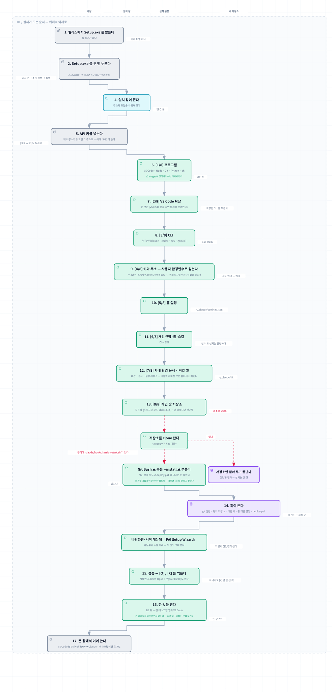

# Claude Code 사내 설치본

윈도우 PC 한 대에 Claude Code 개발 환경을 한 번에 세운다 — 사내 게이트웨이에 붙은 채로.

**포스코 사람용이다.** 게이트웨이는 사내에서만 닿으므로 회사 밖에서는 이 설치본으로 얻을
것이 없다. 사내 PC · 사외 VDI · 사내 VDI · 집 — **네 자리에서 같은 파일을 누르면 된다.**
어느 자리인지는 설치가 스스로 잰다(그 주소에 닿나 안 닿나). 고를 것이 없다.

## 왜 있나

맨바닥 PC 에서 Claude Code 를 쓰려면 프로그램 넷을 깔고, VS Code 확장을 붙이고, 게이트웨이
주소와 키를 사용자 환경변수에 심어야 한다. 순서를 하나 어기면 조용히 어긋난다 — 확장은
깔렸는데 실행할 CLI 가 없거나, 키는 심었는데 창을 안 닫아 안 걸리거나, 파이썬은 깔렸는데
윈도우가 미리 깔아 둔 껍데기가 대신 잡히거나. 다 겪고 나서 순서와 판정을 한 파일에 넣었다.

## 무엇이 깔리나

| | |
|---|---|
| VS Code · **Claude Code 확장** | 확장은 CLI 를 자식으로 부른다 — 둘 중 하나만 있으면 안 돈다 |
| Claude Code CLI · Node.js | 위를 돌리는 것 |
| Git · Python · GitHub CLI | 코드를 짤 사람만. `-NoDevTools` 로 뺀다 |
| Claude 데스크탑 앱 | **사외에서만.** 사내에서는 게이트웨이를 못 물어 쓸모가 없다 |
| 게이트웨이 주소 · 모델 · **키** | 사용자 환경변수로 심는다. 키만 직접 넣는다 — **사외면 안 묻는다** |
| **사내 환경 문서** · **씨앗 둘** | `~/.claude/posco/` · `~/.claude/seeds/gateway/` · `~/.claude/seeds/config-repo/` 로 깔린다. 고를 것이 아니라 환경이라 스위치가 없다 |

## 폴더에 무엇이 들어 있나

풀면 이렇게 생겼다. **누를 것은 `install.cmd` 하나**고 나머지는 그것이 쓰거나, 깔린 뒤에 읽는
것이다.

```text
├─ install.cmd            ← 누르는 것. 이것만 더블클릭한다
├─ install.ui.ps1            설치 창 — 값을 받고 진행을 보여준다
├─ install.ps1               설치 몸통 — 무엇을 어떻게 깔지는 이 한 자리가 든다
├─ install.env               회사 공통값(주소·모델)이 채워져 온다. 키 칸은 비어 있다
├─ install-flow.svg       ← 위 흐름 그림. 더블클릭하면 브라우저가 연다
│
├─ posco/                    사내 게이트웨이 환경 문서 한 층 — 되고 안 되는 것의 진본
│                            (회사 루트 CA `corp-ca.pem` 도 여기 있다 — 설치가 쓴다)
├─ seeds/
│  ├─ gateway/               게이트웨이 배관 씨앗 — 새 프로젝트가 복사해서 출발한다
│  └─ config-repo/           설정 저장소 씨앗 — 「설정 저장소」 칸을 쓸 사람만 본다
│
├─ .claude/                  만든 사람의 작업 규율(규범·룰·스킬). **옵션을 켠 사람만** 깔린다
├─ agents/                   같이 온 에이전트 둘. 위와 같은 옵션이 든다
│
├─ README.md                 이 글
├─ LICENSE                   MIT
├─ .gitattributes            줄끝을 못박는다 — 저장소 사정이라 안 봐도 된다
└─ .githooks/                만든 사람이 커밋할 때 인코딩을 재는 문지기 — 안 봐도 된다
```

`posco/` 와 `seeds/` 는 **고를 것이 아니라 환경**이라 스위치가 없다 — 누가 받아도 홈에 깔린다.
`.claude/` 와 `agents/` 는 반대다: **꺼진 것이 기본**이고 켜야 깔린다.

⚠ **압축 안에서 바로 누르면 안 된다.** 설치는 옆 파일들을 이름으로 찾으므로, 폴더를 통째로
풀어야 위 것들이 서로를 본다.

## Security

**키는 이 폴더에 안 담겨 온다.** 설치가 물어보고, 화면에 안 찍히게 받아 사용자 환경변수로
심는다. **키는 사람마다 제 것이다** — 남의 것을 받아 쓰지 않는다.

`install.env` 에 제 키를 적어 두면 매번 안 묻는데, **그렇게 적었으면 그 폴더를 남에게 그대로
넘기지 않는다.** 받은 그대로의 폴더에는 키 칸이 비어 있다.

## Install

먼저 한 장으로. **띠 넷이 「누가 하나」다** — 손을 대는 것은 `사람` 띠 넷뿐이고 나머지는
저절로 돈다. `내 저장소` 띠는 **아래 「설정 저장소」 칸을 채운 사람만** 도는 갈래다.
빨간 곁줄이 실제로 사람들이 걸린 자리다.



폴더 안의 `install-flow.svg` 를 더블클릭해도 열린다(브라우저가 띄운다). 글자가 잘려 보이면
그 자리에 마우스를 올린다 — 전문이 뜬다.

1. zip 을 받아 **폴더를 통째로 풀어** 아무 데나 둔다 (압축 안에서 바로 누르면 안 된다 —
   설치가 옆 파일들을 못 찾는다)
2. **`install.cmd` 를 더블클릭한다** — 설치 창이 뜬다
3. **API 키**를 넣는다. 주소는 채워져 있다
4. **[설치 시작]** 을 누른다 — 막대가 차는 동안 기다린다
5. **열려 있는 VS Code 를 전부 닫고 새로 연다**

5번을 건너뛰면 안 된다. 창은 뜰 때 환경을 한 번 복사하고 그 뒤에 바뀐 것은 안 따라온다 —
방금 심은 키를 낡은 창은 못 본다.

### 윈도우가 한 번 막는다 — 거기서 멈추지 않는다

인터넷에서 받은 파일이라 **처음 누를 때 파란 경고창이 뜬다.**

> **Windows의 PC 보호** — 「추가 정보」를 누르면 아래에 **「실행」** 단추가 나온다.

서명을 안 산 파일이라 그렇고, 폴더 안의 어느 파일도 인터넷에 다시 나가지 않는다.
경고창을 닫아 버리면 아무 일도 안 일어난 것처럼 보이므로 — **눌러야 시작된다.**

### 옵션 셋 — 그대로 두면 된다

| 칸 | 기본 | 무엇 |
|---|---|---|
| 개발 도구도 깝니다 | **켜짐** | Git · Python · GitHub CLI. 코드를 안 짜면 꺼도 된다 |
| 같이 온 규범 · 룰 · 스킬도 깝니다 | **꺼짐** | 만든 사람의 작업 규율이 같이 들어 있다. 쓸 사람만 켠다 — 안 켜도 설치는 완전하다 |
| 이미 깔린 것도 최신으로 올립니다 | **켜짐** | 옛 판이 깔려 있으면 올린다 |

### 규범 · 룰 · 스킬 칸은 **제 것으로 갈아 끼울 수 있다**

가운데 칸이 깔아 주는 것은 「만든 사람의 것」이 기본이지만, **설치는 이름을 하나도 안 본다** —
아래 네 자리에 무엇이 들었든 그것을 그대로 홈에 깐다. 그러니 폴더를 풀고 **내용만 제 것으로
바꿔 넣으면** 옵션을 켰을 때 제 규율이 깔린다. 고칠 코드가 없다.

| 폴더의 이 자리 | 홈의 이 자리로 |
|---|---|
| `.claude/CLAUDE.global.md` | `~/.claude/CLAUDE.md` |
| `.claude/rules.global/` | `~/.claude/rules/` |
| `.claude/skills/` | `~/.claude/skills/` |
| `agents/` | `~/.claude/agents/` |

자리가 비어 있으면 **건너뛰고 실패로 세지 않는다.** 그래서 넷 중 일부만 바꿔 넣어도 된다 —
에이전트만 제 것을 쓰고 룰은 안 쓰는 식으로.

⚠ **덮어쓰는 것이 아니라 합친다.** 같은 이름은 갈리지만 홈에 이미 있던 **다른 이름은 남는다.**
그래서 받은 그대로 한 번 깔았다가 제 것으로 바꿔 다시 깔면 **먼저 깔린 것이 홈에 섞여 남는다.**
깨끗하게 갈려면 `~/.claude/` 의 `skills` · `rules` · `agents` 를 먼저 지우고 깐다.
(`CLAUDE.md` 는 파일 하나라 통째로 갈린다.)

## Usage

설치 창의 기록 칸 마지막이 이렇게 찍힌다. **하나라도 `[X]` 면 안 선 것이다** — 창 아래
줄도 빨갛게 바뀐다.

```text
=== 검증 ===
  [O] VS Code
  [O] 클로드 확장
  [O] Claude Code CLI
  [O] ANTHROPIC_BASE_URL
  [O] ANTHROPIC_AUTH_TOKEN
```

새 VS Code 에서 `Ctrl+Shift+P` → `Claude` 로 확장을 연다.

### 같이 깔린 환경 자료 — 어디에 있나

| 자리 | 무엇 |
|---|---|
| `~/.claude/posco/` | **사내 게이트웨이 환경 문서 한 층.** 무엇이 되고 안 되는지는 **이 폴더 전체**가 답한다 — 한 장만 보고 판정하지 않는다 |
| `~/.claude/seeds/gateway/` | **게이트웨이 배관 씨앗.** 새 프로젝트를 시작할 때 이 폴더를 복사해 출발한다. 임포트하는 묶음이 아니다 |
| `~/.claude/seeds/config-repo/` | **설정 저장소 씨앗.** 아래 「설정 저장소」 칸을 쓰려는 사람만 본다 — 그 칸이 기대하는 저장소를 만드는 골든이다 |

### 「설정 저장소」 칸 — 안 넣어도 된다

빈 칸이 **기본이고 맞는 답이다.** 위의 것은 이미 다 깔린다.

넣는 칸은 *제 저장소*를 이어 붙이는 자리다. 설치는 **`~/repos/<저장소 이름>`** 으로 받고,
**여러 개는 빈칸으로 가른다** — 주소에는 빈칸이 없으므로 그것이 가르는 자다.

```text
https://github.com/나/설정.git  https://github.com/나/메모.git
```

받은 뒤 **갈래가 둘이고 둘 다 정당하다.** 가르는 자는 **파일 이름 하나**, 받아온 저장소 뿌리의
**`bootstrap-vdi.sh`** 다.

| 그 이름의 파일을 | 설치가 하는 일 |
|---|---|
| **아무도 안 들었다** | **받아 두고 끝낸다** — 받은 자리를 하나씩 찍는다. 저장소만 들고 다니려면 이것이 전부다 |
| **든 저장소가 있다** | 그것을 Git Bash 로 부르고 **그 뒤는 그 저장소가 든다** — git 신원 · 형제 저장소 · 키 · 로그인 · 배포 |

여럿이 그 파일을 들고 있으면 **첫 것만 부르고 나머지는 이름을 찍는다** — 둘을 잇달아 부르면
뒤엣것이 앞엣것의 키·설정을 덮는데, 그 순서는 사람이 정한 것이 아니다.

⚠ **하나가 져도 나머지를 계속 받는다.** 못 받은 것은 주소와 함께 빨갛게 찍힌다.
⚠ **아무도 안 든 갈래도 조용히 넘어가지 않는다** — 부트스트랩이 왜 안 돌았는지를 그 자리에서
말한다. 자동화까지 원하면 아래 씨앗을 복사해 그 이름으로 두면 된다.
⚠ **이 칸을 채우면 위의 키 칸이 꺼진다** — 같은 키가 두 자리에 살면 안 되기 때문이다. 그래서
**부트스트랩이 안 돌면 키를 심은 자가 없어**, 설치가 그것을 빨갛게 찍고 무엇을 하라고 댄다.
저장소만 받아 두려면 키는 칸을 비우고 한 번 더 눌러 직접 넣으면 된다.

**그런 저장소를 만들려면 — 씨앗이 같이 왔다.** 맨바닥에서 짜지 않는다.
`~/.claude/seeds/config-repo/` 에 **복사해서 출발하는 골든**이 깔린다 — 익명
몸통(`bootstrap-vdi.sh`)과 제 값을 적는 선언(`bootstrap.conf`) 둘이다. 저장소를 하나 만들어
그 둘을 뿌리에 복사하고 **선언만 고친다.** 몸통은 안 고친다 — 이름을 몸통에 박으면 그 파일이
당신 것이 되어 남이 못 쓴다.

몸통을 맨바닥에서 짜면 **이미 값을 치른 함정 셋을 처음부터 다시 겪는다** — 창이 PATH 를 못
물려받는 것, 윈도우가 깔아 둔 파이썬 껍데기가 「있음」을 내는 것, 마지막 `echo` 로 끝내면
판정이 늘 `0` 이 되는 것. 씨앗의 곁말에 그 셋이 **왜**와 함께 박혀 있다.

자세한 것은 그 폴더 `README.md` 가 든다 — 출발하는 다섯 걸음, 손으로 재 보는 법, 종료코드 표.

옵션 둘은 창에서 고른다. 화면 없이 돌려야 하면 PowerShell 에서 직접 부른다:

```powershell
.\install.ps1 -NoDevTools          # Git·Python·GitHub CLI 를 건너뛴다
.\install.ps1 -WithPersonalConfig  # 같이 온 규범·룰·스킬을 홈에 깐다
.\install.ps1 -NoUpgrade           # 이미 깔린 것을 그대로 둔다 (기본은 올린다)
```

**여러 번 눌러도 안전하고, 누를 때마다 최신으로 올린다.** 이미 있는 것은 판을 견줘 바뀐
것만 찍는다 — `올렸다 1.2.3 -> 1.2.9` 처럼. 그래서 이 설치본은 처음 세울 때만이 아니라
**갱신할 때도 같은 것을 누르면 된다.**

## 안 될 때

| 화면 | 왜 · 어떻게 |
|---|---|
| `winget 이 없다` | 설치가 먼저 되살려 본다 — 프로필 재등록, 안 되면 GitHub 에서 받기. 그래도 안 되면 진행하되 모자란 것 이름을 끝에 댄다 |
| `[X] 클로드 확장` | VS Code 설치가 먼저 실패한 것이다. 위쪽 빨간 줄을 본다 |
| `[X] ANTHROPIC_...` | 키를 안 넣었거나 빈 값이다. 다시 눌러 넣는다 |
| 확장은 도는데 응답이 안 온다 | 낡은 창이다. VS Code 를 **전부 닫고** 새로 연다 |
| winget 이 정책에 막힌다 | 사내 PC 정책이다. IT 에 문의한다 |

## 새 판이 나오면

모델 이름이 바뀌거나 게이트웨이가 옮겨지면 **이 폴더가 낡는다** — 깔린 것이 저절로
따라가지는 않는다. 그때는 새 zip 을 받아 같은 자리에 풀고 `install.cmd` 를 다시 누른다.
**여러 번 눌러도 안전하다** — 이미 맞는 것은 안 건드리고 달라진 것만 고친다.

받은 판이 언제 것인지는 릴리스 쪽에 적혀 있다.

## 문의

이 설치본을 낸 사람에게. 설치 화면을 **통째로 복사해서** 보내면 빠르다 — 어느 칸에서
멈췄는지가 거기 다 찍힌다.

## 쓰임 제한

**포스코 사내 환경용이다.** 게이트웨이는 사내에서만 닿으므로 회사 밖에서는 쓸 데가 없다.
키는 사람마다 제 것이고, 이 폴더에는 안 들어 있다.
